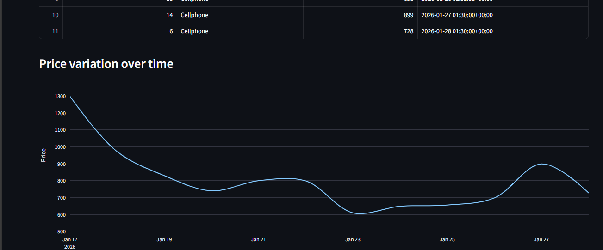

<p align="center">
  
</p>

> [!WARNING]
> This project is currently in development. The **Price Prediction** logic and the implementation of the **Linear Regression** library were developed with significant assistance from **Generative AI**. This is a functional study and results should be interpreted as experimental.

## 📋 The Project
**PriceInsight-Engine** is a data-focused project designed to automate the tracking of hardware prices. The goal is to move away from complex and easily broken scraping rules by using an **AI Semantic Layer** to handle data extraction. 

The system captures raw HTML from e-commerce sites, uses an LLM to identify and extract the correct price, stores it in a cloud database, and displays the results in a dashboard with a basic trend forecast. This project was built to explore the integration of different technologies in a single automated pipeline.

---

## 🏗️ Architecture & Logic
The project is divided into modular components to keep the data flow organized and maintainable:
---
| Category | Badges |
| :--- | :--- |
| **Testing & CI** |   |
| **Data & AI** |  -orange?style=flat-square)  |
| **Infra & DB** |    |
| **Frontend** |   |

### 1. Data Collection (Scraping)
The `scrap.py` module uses `Requests` and `BeautifulSoup` to fetch content from e-commerce pages. 
* **Cleaning:** To save processing power and tokens, the script removes unnecessary tags like `<script>` and `<style>` before passing the text forward.
* **Headers:** It uses browser-mimicking headers to avoid common anti-bot blocks.

### 2. Intelligent Processing (AI Layer)
Instead of hardcoded rules (Regex), the `ai_processor.py` sends the cleaned text to the **Llama-3.3-70b** model via **Groq**.
* **Task:** The AI extracts only the lowest cash price (PIX/Boleto) and formats it into a strict JSON structure.
* **Validation:** The code includes a formatting step to ensure the string returned by the AI is a valid JSON before it reaches the database.

### 3. Persistence (Database)
Managed by `database.py` and `crud.py`, the system uses **SQLAlchemy** to interface with a **PostgreSQL** database hosted on **Railway**.
* **Safety:** Every insertion includes a `session.rollback()` and `session.close()` routine to prevent connection leaks and ensure data integrity.
* **Automatic Logs:** The database automatically records the date of each entry using UTC timestamps.

### 4. Forecasting (Statistics)
The `prevision.py` module uses `Scikit-learn` to perform a **Linear Regression** on historical data.
* **Logic:** It calculates the "slope" of price changes to estimate the probability of the price rising or falling in the near future.
* **Data Cleaning:** The script filters out outliers (like prices over 100k) to keep the prediction as accurate as possible.

### 5. Visualization (Dashboard)
The `app.py` file builds a web interface using **Streamlit**.
* **Analytics:** It pulls data from the database using **Pandas** and renders interactive line charts via **Plotly**.
* **Real-time:** The dashboard calculates AI probabilities on-the-fly based on the latest database updates.

---

## 🟦 System Interface
<p align="center">
  
  <br>
  
</p>

## 🛠️ Technical Stack
* **Language:** Python 3.10+
* **Infrastructure:** GitHub Actions (Automation) & Railway (Cloud Hosting)
* **AI:** Groq API (Llama 3.3-70b)
* **Libraries:** SQLAlchemy, Scikit-learn, Pandas, Streamlit, Plotly, BeautifulSoup4

---

## 🟦🔵 Environment Setup
To run this project, you must configure a `.env` file with the following variables:
```env
GROQ_API_KEY=your_groq_api_token
DATABASE_URL=your_postgresql_railway_url
